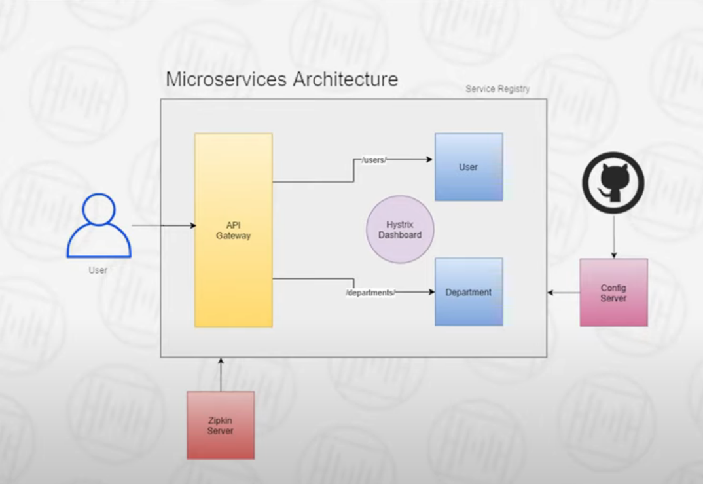

# Spring Microservices

https://www.youtube.com/watch?v=BnknNTN8icw

## What is a microservice?
- Basically a SpringBoot Application you need a real computer to run on
- Each MS interacts w/ other MS by making API calls
- Each MS has a dedicated port

## Microservice Architecture
